# C++网络高级

## 一>  linux入门

### 1.1>C++环境的搭建

#### 1>环境搭建

#linux #环境 #gcc
1、安装g++编译环境、gcc编译环境

```bash
sudo yum install gcc
sudo yum install gcc-c++
```


### 1.2>sys库的使用

#### 1>man手册的解析以及使用方法

#man手册

#### 2>常用的内核提供的函数库 sys

#### 3>使用GDB程序

#GDB

break(b)

next(n)


#### 4> linux中库的概念（静态库与动态库）

#静态库与动态库

1, 为什么引入库

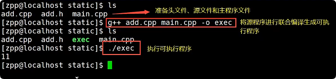

在上述案例中，主程序要是有的源程序代码，在add.cpp中，如果项目结束后，到了交付阶段，由于主程序的生成需要其他程序联合编
译，那么就要将源程序打包一起发给老板，这样该程序的开发者自身的价值就不大了，该项目的知识产权就很容易被窃取。为了保护我们
的知识产权，我们引入了库的概念。

2, 什么是库

库在linux中是一个二进制文件，它是由.cpp文件（不包含main函数）编译而来，其他程序如果想要使用该源文件中的函数时，只需在编译生成可执行程序时，链接上该源文件生成的库文件即可。库中存储的是二进制文件，不容易被窃取知识产权，做到了保护作用。

库在linux系统中分为两类，分别是静态库和动态库

windows:

​	***.lib:静态库

​	***.dll:动态库

linux:

​		***.a:静态库

​		***.so:动态库

[[2026-06-06#==gcc与g++命令主要区别==]]

3, 静态库及其制作使用

#静态库及其制作使用

```
概念:将一个***.cpp的文件编译生成一个lin***.a的二进制文件,当你需要使用该源文件中的函数时,只需要链接该库即可,后期可以直接调用
静态体现在:在使用g++编译程序时,会将你的文件和库最终生成一个可执行程序(把静态库也放入到可执行程序中),每个可执行程序单独拥有一个静态库,体积较大,但是,执行效率较高
```

3.1准备工作

add.h

```c
#ifndef _ADD_H_
#define _ADD_H_

int add(int m,int n);		//函数声明

#endif
```

add.cpp

```c
#include "add.h"
int add(int m, int n)
{
	return m+n;
}

```

main.cpp

```c
#include <iostream>
#include<stdio.h>
#include "add.h"
using namespace std;

int main(int argc ,const char *atgv[])
{
	cout << add(3,8) << endl;		//调用外部文件中的相关函数
	return 0;
}
```

3.2编译生成静态库

```
g++ -c ***.cpp -o ***.o		//只编译不链接生成二进制文件
ar -crs lib***.a ***.o		//编译生成静态库

如果有多个.o文件共同编译生成静态库 : ar -crs lib***.a ***.o	 xxx.o ....

ar:用于生成静态库的指令
c:用于创建静态库
r:将文件插入或者替换静态库中同名文件
s: 重置静态库索引
```

3.3使用静态库

```
g++ main.cpp -L 库的路径 -l库名 -I库的名字
```

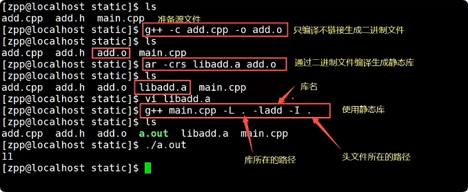


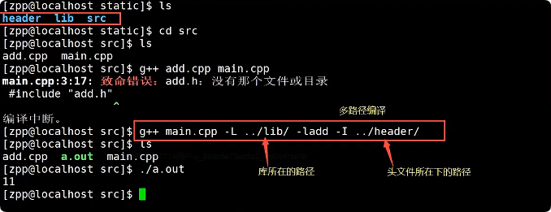


4, 动态库及其制作使用

#动态库及其制作使用

```
概念:将一个***.cpp的文件编译生成一个lin***.so的二进制文件,当你需要使用该源文件中的函数时,只需要链接该库即可,后期可以直接调用
动态体现在:在使用g++编译程序时,会将你的文件和库中的相关函数的索引表一起生成一个可执行程序,每个可执行程序只拥有函数的索引表,当程序执行到对应函数时,会根据索引表,动态寻找相关库所在位置进行调用,体积较小,但是,执行效率较慢,但是可以多个程序共享同一个动态库,所以,动态库也叫共享库
```


4.1准备工作

add.h

```c
#ifndef _ADD_H_
#define _ADD_H_

int add(int m,int n);		//函数声明

#endif
```

add.cpp

```c
int add(int m, int n)
{
	return m+n;
}

```

main.cpp

```c
#include <iostream>
#include<stdio.h>
#include "add.h"
using namespace std;

int main(int argc ,const char *atgv[])
{
	cout << add(3,8) << endl;		//调用外部文件中的相关函数
	return 0;
}
```


4.2 编译生成动态库

```
g++ -fPIC -c ***.cpp -o ***.o		//编译生成二进制文件
g++ -shared ***.o -o lib***.so		//依赖于二进制文件生成一个动态库

上述两个指令可以合成—个指令
g++ -fPIC -shared ***.cpp -o lib***.so
```


4.3使用动态库

```
g++ main.cpp -L 库的路径 -l库名 -I库的名字
```

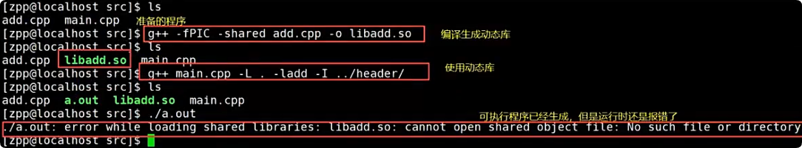


4.4 以上错误的解决方式

方式1：更改路径的宏

```
export LD_LIBRARY_PATH=库的路径
```

方法2：将自己的动态库放入到系统的库由数目录中(/lib64/usr/lib64）


#### 5>如何使用第三方库

1.c/c++语言默认是支持标准输入输出库的,但是其他的相关函数库需要第三方引入,并且,编译程序时,需要链接上对应的库

2.使用数学库:

```
 #include<math.h>
```

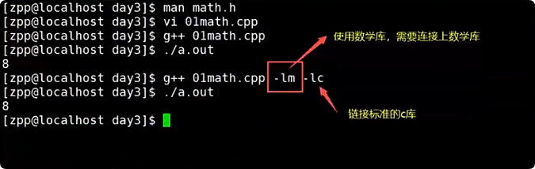

3.使用线程支持类库:包含include<pthread.h>

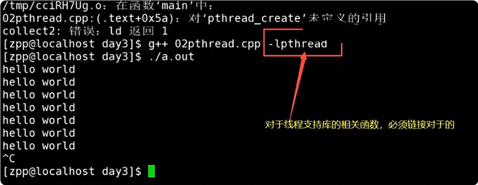


```c
#include<iostream>
#include<math.h>		//数学相关函数所在的头文件
#include<pthread.h>		//线程支持库的相关头文件
#include<unistd.h>
using namespace std;

//定义分支线程的线程体函数
void *task(void *arg)
{
	while(1)
	{
		cout << "hello world"<<end;
		sleep(1):		//休眠菡数
	}
}

int main(int argc, const char* targv[])
{
	pthread_t tid;	//定义一个线程号变量，用于存储创建出来的线程的线程号

	//创建线程
	if(pthread_create(&tid, NULL，task，NULL)I= 0)
	{
		cout << "pthread_create error" << endl;
	}
	//主线程
	while(1):
	
	return 0;
}
```


### 1.3Makefile文件和CMake文件

#Makefile

#### 1>Makefile文件

##### 1>什么是Makefile

```
用于工程项目管理的一个文本文件，文件名为Makefile的文本文件
Makefile可以大写，也可以小写，一般Makefile首字母使用大写
如果Makefile和makefi1e两个文件都存在，系统会默认使用小写的
```

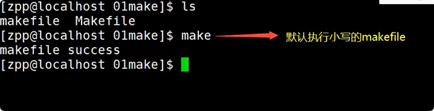

#make

##### 2>什么是make

```
make是一个执行Makefile的工具，是一个解释器
用来对Makefile中的命令进行解析并执行一个shell指令
make这个指令在/usr/bin中
如果没有安装make	sudo yum install make
查看是否安装成功的指令:
make --version
```

##### 3>Makefile的用途

```
描述了整个工程的编译、链接规则
软件项目的自动化编译，相当于给软件编译写一份脚本文件
```

##### 4>学习Makefile的必要性

```
Linux/uinx环境下开发的必备技能
系统架构师、项目经理的核心技能
研究开源项目、Linux内核原码的必需品
加深对底层软件构造系统及过程的理解
```


##### 5>如何学习Makefile

1.理论基础

```
软件的构造过程、程序的编译和链接：预处理-->编译-->汇编-->链接
面向依赖的思想：
依赖一个.cpp文件的程序
可执行程序	<--依赖于-- .o文件 <--依赖于-- .s文件 <--依赖于-- .i文件 <--依赖于-- .cpp文件

一个依赖多个.cpp文件的程序
可执行程序	<--依赖于-- .o文件 <--依赖于-- .s文件 <--依赖于-- .i文件 <--依赖于-- .cpp文件
			|	<--依赖于-- .o文件 <--依赖于-- .s文件 <--依赖于-- .i文件 <--依赖于-- .cpp文件
			|	<--依赖于-- .o文件 <--依赖于-- .s文件 <--依赖于-- .i文件 <--依赖于-- .cpp文件
			|	<--依赖于-- .o文件 <--依赖于-- .s文件 <--依赖于-- .i文件 <--依赖于-- .cpp文件
```

2.项目编程基础

```
C++程序语言基础
c语言基础
多文件原码管理、头文件包含、函数声明与定义
```


##### 6>Makefile的工作过程

```
Makefile本身是面向依赖进行编写的
源文件	-->	编译	---->	目标文件	--->	链接	--->	可执行文件
hello.cpp	---->	hello.0	--->	hell
本质上一步就可以生成可执行程序，但是，由于在生成可执行程序时，可能会有多个文件进行参与，后期其他文件可能要进行更改，更改后，会影响
到可执行程序的执行，其他没有更改的文件也要参与编译，浪费时间
```


##### 7>第一个Makefile

1.编写一个文件


2.通过终端编译程序


3.使用Makefile

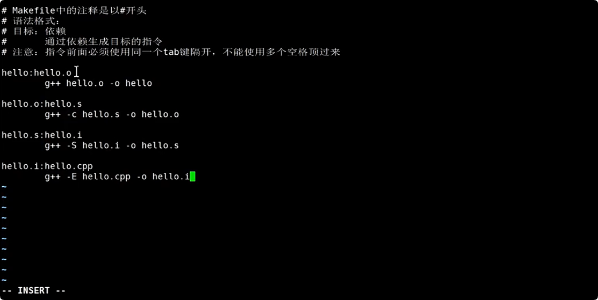

```
Makefile中的注释是以#开头
#语法格式：I
#目标：依赖
#	通过依赖生成目标的指令
#注意：指令前面必须使用同一个tab键隔开，不能使用多个空格顶过来
hello:hello.0
	g++ hello.0 -0 hello

hello.o:hello.s
	g++ -c hello.s -0 hello.0

hello.s:hello.1
	g++ -S hello.1 -0 hello.s

hello.i:hello.cpp
	q++ -E hello.cpp -o hello.1
```

简化的Makefile文件

```
hello:hello.0
	g++ hello.0 -0 hello
	
hello.o:hello.cpp
	g++ -c hello.cpp -o hello.o
```


4.执行Makefile文件

```
 make	--->默认找到Makefile中的第一个目标开始进行执行
 make 目标	--->找到对应的目标进行执行
```

```
hello:hello.0
	g++ hello.0 -0 hello
	
hello.o:hello.cpp
	g++ -c hello.cpp -o hello.o
//此处一个规则是没有依赖，只有目标和指令
clean:
	rm hello.o hello
```

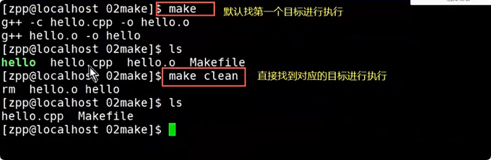

##### 8>Makefile的语法规则

1.规则

构成Makefile的基本单元，构成依赖关系的核心部件
其他内容可以看做为规则的服务
2、变量
类似于C++中的宏，使用变量：

```
$(变量名）或者${变量名}
```

作用：使得Makefile更加灵活
3、条件执行
根据某一变量的值来控制make执行或者忽略Makefile的某一部分
4、函数 
文本处理函数:字符串的替换、查找、过滤等待

文件名的处理:读取文件/目录名、前后缀等待

5.注释

Makefile中的注释,是以#号开头


##### 9>规则

1、规则的构成：目标、目标依赖、命令
2、语法格式

```
目标:目标依赖
	命令


注意事项:
	命令必须使用tab键开头，一般是shel1指令
	一个规则中，可以无目标依赖，仅仅是实现某种操作
	一个规则中可以没有命令，仅仅描述依赖关系
	一个规则中，必须要有一个目标
```

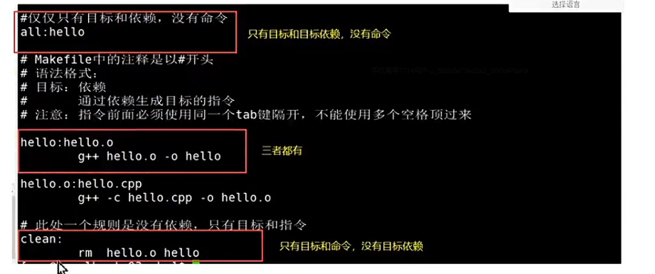

3.目标详解

1)默认目标

```
一个Makefi1e里面可以有多个目标，一般会选择第一个当做默认目标
也就是make默认执行的目标
```


2)多目标

一个规则中可以有多个目标,多个目标具有相同的生成命令和依赖文件

```
aaa bbb clean distclean:
	rm hello.[^cpp] hello
```

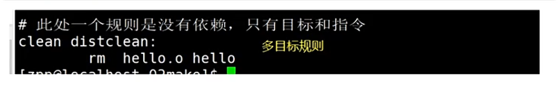

3)多目标规则

多个目标可以是同一目标

```
all:testl
all:test2
testl:
echo "hello"
test2:
echo "world"
```

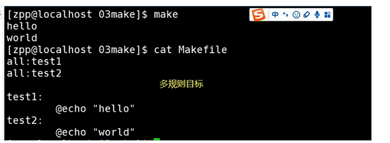


4)伪目标


```
并不是一个真正的文件名，可以看做是一个标签
无依赖，相比一般文件，不会重新生成、执行
伪目标：可以无条件执行，相当于对应的指令

	.PHONY:clean	#设置伪目标
	clean:
	rm hello.[Acpp] hello
```


4.


## 二>	标准IO与文件IO

### 一、标准IO与文件IO的区别

1.1	IO概念

1>	IO：顾名思义就是输入输出，程序与外部设备进行信息交换的过程称为IO操作
2>	最先接触的iO：#include<stdio.h标准的输入输出头文件

### 二、标准IO

### 三、文件IO

## 三>	多进程

### 3.1 多进程理论基础

### 3.2 多进程实现

### 3.3 进程间通信IPC

## 四>	多线程

### 4.1 C++中多线程

### 4.2 多线程的概念

### 4.3 多线程编程

### 4.4 线程同步互斥机制

## 五>网络编程基础

### 一、网络编程的基本概念

##### 1>	通信协议


**1.1	为什么引入网络编程**

1>	回顾之前学习的进程间通信方式:
		内核提供三种：有名管道、无名管道、信号
		system V提供三种：消息队列、共享内存、信号量集
2>	以上通信方式，仅仅局限于同一主机之间多个进程间通信方式，不能实现跨主机的通信方式
3>	如果想要实现跨主机的通信方式，我们引入的套接字的通信方式，就是该门课程要讲述的内容


##### 1.2网络的发展历史

1>	第一阶段：APRAnet阶段--------冷战的产物
		阿帕网，是Internet的最早雏形，注意，此时的网络**不能实现互联不同类型的计算机和不同类型的操作系统，并且没有纠错功能**
2>	TCP\IP两个协议的阶段

​		协议：在计算机网络中，要做到有条不素的交换数据，需要遵循一些实现约定好的规则，这些规则明确规定了所交换数据的格式以及相关的同步问题。


```
网络体系结构的概念
1>	每一层都有自己独立的分工，单每一层都不可获取
2	>通常将功能相近的协议组织在一起放在一层，称为协议栈，所以每一层中共实有多个协议
分层的好处：
1>	各层之间相互独立，每一层不需要知道下一层如何实现，而仅仅只需要知道该层通过层间接口所提供的服务
2>	稳定、灵活性好。当每一层出现变化时，只要层间接口保持不变，则当前层的上层和下次不受影响
3>	易于实现和维护，只要知道哪一层的功能，直接对指定层进行维护即可
4>	促进标准化工作，每一层所提供的服务和技术都有精确的说明
5>	结构上是不可分割的，各层之间都采用的最合适的技术来实现
```

1、OSI（开发系统互联模型）是由ISO（国际标准化组织）提出的理想化模型，一共有七层：物数网传会表应


2、TCP\IP协议族的体系结构：也是互联网事实上的工业标准
		一共提供的四层：应用层、传输层、网络层、链路层（网络接口层和物理）


3、虽然TCP\IP体系结构只有四层，但是做的事和OSI的七层体系结构是一样的
4、TCP\IP四层网络体系结构和OSI七层网络体系结构的对应关系如下


4>	TCP\IP协议族中常见的协议

```
应用层：
HTTP (Hypertext Transfer Protocol)	超文本传输协议
万维网的数据通信的基础

FTP(File Transfer Protocol)	文件传输协议
是用于在网络上进行文件传输的一套标准协议，使用TCP传输

TFTP(Trivial File Transfer Protocol)	简单文件传输协议
是用于在网络上进行文件传输的一套标准协议，使用UDP传输

SMTP(Simple Mai1 Transfer Protocol) 简单邮件传输协议
一种提供可每且有效的电子邮件传输的协议
----------------------------------------------------------------------------------------------
传输层：
TCP(Transport Control Protocol)	传愉控制协议
是一种面向连接的、可罪的、基于字节流的传输层通信协议

UDP(User Datagram Protocol)	用户数据报协议
是一种无连後、不可靠、快连传输的传输层通信协议
----------------------------------------------------------------------------------------------
网络层：
IP (Internetworking Protocol)	网际互连协议
是指能够在多个不同网络间实现信息传输的协议

ICMP(Internet Control Message Protocol)	互联网控制信息协议
用于在IP主机、路由器之问传递控制消息、ping命令使用的协议

IGMP (Internet Group Management Protocol)	互联网组管理
是一个组措协议，用于主机和组播路由器之间通信
----------------------------------------------------------------------------------------------
链路层：
ARP(Address Resolution Protocol)	地址解析协议
通过IP地址获取对方mac地址

RARP(Reverse Address Resolution Protocol)	逆向地址解析协议
通过mac地址获取ip地址
```

注意：每次使用的协议时由下层决定的，不能乱用


##### 1.3数据传输中封包和拆包过程

1>案例引入


2>	网络通信中的封包拆包过程的详解


3>	对等层（不同主机的同一层称为对等层）中数据包的名称


一顿数据的说明：
1、大小为：64-1518	(包含以太网首部14字节，以太网尾部4字节）
2、如果数据大于MTU(最大传输单元，linux中默认是1500)，需要分成两个或多个数据包进行传输
3、可以使用ifconfig查看mtu的值


##### 1.4	TCP和UDP的区别

1>两者都属于传输层的相关协议

2> TCP而言—>稳定

```
1、TCP提供了面向连接的、可靠的数据传输服务
2、传输过程中，能够保障数据无误、数据无丢失、数据无重复、数据无失序
	TCP通信中会给每个数据包编上编号，该编号称为序列号
	每个序列号都需要应打包应答，如果没有应答，则会将上面的数据包重复传输
3、TCP通信中，数据传输效率较低，耗费资源较多
4、数据收发是不同步的
	为了提高传输效率，tcp通信中会将多个较小的，发送时间间隔较短的数据包，沾成一个数据包进行发送，该现象称为沾包现象（1.增长发送时间间隔，2.数据包添加头包（常用））
5、TCP通信使用场景：对于传输质量要求较高的以及传输量较大的数据通信，在需要可靠传输信息的场合，一般使用TCP通信
	例如：账户和密码登录注册、大型文件的下载
```


3>	UDP通信 ----->快速


```
1、提供面向无连接、不保证数据可靠传输、尽最大努力传输的协议
2、数据传输过程中，可能会出现数据丢失、重复、失序、乱序等现象
3、数据传输效率较高、实时性高
4、限制每次传输的数据大小，多出部分会直接被忽略删除
5、数据的收发是同步的，不会沾包
6、使用场景：发送小尺寸的，在收到数据后给出应答比较困难的情况下，采用udp通信
	例如：广播、组播、通信软件的音视频传输
```


##### 1.5	字节序的相关内容

1>	字节序：在计算机存储**多字节整数**时，由于cpu的处理器架构不同，我们将其分为大端存储的主机和小端存储的主机

​		大端存储：内存地址低位存储数据的高位

​		小端存储：内存地址地位存储数据的位


2>	验证当前主机是大端存储还是小端存储

使用指针验证

```cpp
#include <myhead.h>

int main(int argc,const char *argv[])
{
    //定义一个整型变量
    int num = 0x12345678
    
    //定义一个
    char *ptr = (char *)&num;		
    //如果是整数类型，那么会读取四个字节，用一个字符类型指针指向其初始地址，那读取内容的时候，就只取一字节的内容
    //如果ptr中的内容是ox12则是大端存储
	//如果是0x78则是小端存储
	if(*ptr == 0x12)
	{
		cout<< "big endian"<<endl;
    }else if(*ptr == 0x78)
    {
		cout <"little endian"<<endl;
    }
	return 0；
}
```

使用共用体验证主机的大小端

```cpp
#include <myhead.h>

//定义一个上共用体，多个成员共享同一个内存空间，共享的是所占内存最大的成员空间
union Info
{
    int num;		//四字节整数
    char ch;		//一字节整数
}
int main{
     //定义一个共用体变量
    union Info temp;
    
	//给其整型数据赋值
	temp.num=0x12345678;
    
	//判断其ch成员的值
	if(temp.ch == 0x12)
    {
        cout<<"big endian"<<endl;
    }else if(temp.ch == 0x78)
    {
        cout<<"little endian";
    }
    
    return = 0;
    
}
```


3>	由于不同主机之间存储方式不同，可能会出现，小端存储的主机的多字节整数，在网络传输过程中，明明没有出现任何问题，但是，由于大小端存储问题，导致多字节整数传输出现错误。

​		**基于此，我们引入了网络字节序的概念，规定，网络字节序都是大端存储的**

无论发送端是大端存储还是小端存储，在传输多字节整数时，一律先转换为网络字节序，经由网络传输后，到达目的主机后，再转换
为主机字节序即可

4>		系统给大家提供的一套有关网络字节序和主机字节序之间相互转换的函数
			主机：host

​			网络：network

​			转换： to

```cpp
#include <arpa/inet.h>
uint32_t htonl(uint32_t hostlong)；//将4字节无符号整数的主机字节序转网络字节序，参数时主机字节序，返回值时网络字节序
    
uint16_t htons（uint16_t hostshort)；//将2字节无符号整数的主机字节序转网络字节序，参数时主机字节序，返回值时网络字节序
    
uint32_t ntohl(uint32_t netlong)；//将4字节无符号整数的网络字节序转换为主机字节序，参数时网络字节序，返回值是主机字节序

uint16_t ntohs（uint16_t netshort)；//将2字节无符号整数的网络字节序转换为主机字节序，参数时网络字节序，返回值是主机字节序
```

5>	何时使用网络字节序转换函数

1.在进行多字节整数的网络传输时，需要使用字节序转换函数

2.进行单字节数据传输时，不需要使用

3.在网络中传输字符串时，也不需要使用

##### 1.6>	IP地址


1>	ip地址是主机在网络中的唯一标识，由两部分组成，分别是网络号和主机号

​		网络号:确定计算机所从属的网络

​		主机号:标识该设备在该网络中的一个编号

2>	作用: 在网络传输过程中,给网络传输载体必须添加的信息，指定源ip地址和目的ip地址，以便于找到目的主机

3> 	ip地址的分类

		1、IPV4：是使用4字节无符号整数表示的一个ip地址，取值范围[0,2^32-1]
	
			一共有四十多亿个，采用相关技术进行扩充
	
			局域网扩充：为了解决IP地址不够用，让多个主机共享一个IP地址
			WAN：wide area network（广域网）
			LAN：local area network（局域网）
		2、IPV6：使用16字节无符号整数表示的一个ip地址，取值范围是[0,2^128-1]
		
		3、注意：ipv6不兼容ipv4
4>	IP地址的划分：由于IP地址比较庞大，我们将其进行分组，一共分为5类网络，分别是A类、B类、C类、D类、E类


| 网络类型 |           取值范围            | 网络号个数 | 主机号个数 | 用途                 |
| -------- | :---------------------------: | ---------- | ---------- | -------------------- |
| A类网络  | 1.0.0.0. -----127.255.255.255 | 2^7        | 2^24       | 已经保留不供给使用   |
| B类网络  | 128.0.0.0-----191.255.255.255 | 2^14       | 2^16       | 名地址网管中心       |
| C类网络  | 192.0.0.0-----223.255.255.255 | 2^21       | 2^8        | 家庭、校园、公司使用 |
| D类网络  | 224.0.0.0-----239.255.255.255 |            |            | 组播IP               |
| E类网络  | 240.0.0.0-----255.255.255.255 |            |            | 保留、实验室使用     |


5>	特殊的ip地址

```
1、网络号+全为0的主机号：表示该网络，不分配给任何主机使用，例如：192.168.10.02、
2、网络号+全为1的主机号：表示当前网络的广播地址也不分配给任何主机使用，例如：192.168.10.255
3、网络号+主机号为1：默认表示网关，当然可以自己制定网关ip
4、127.0.0.0：木地环回ip，当没有网络时，用于测试当前主机的ip
5、0.0.0.0：表示当前局域网中的任意一个主机号
6、255.255.255.255：一般表示广播地址
```

6>	点分十进制

为了方便记忆，我们将ip地址的每一个字节单独计算出十进制数据，并用点进行分割，这种方式，称为点分十进制，在程序中使用的是
字符串来存储的。但是，ip地址的本质是4字节无符号整数，在网络中进行传输时，需要使用的是4字节无符号整数，而不是点分十进制的字符申。此时，就需要引入关于点分十进制数据向4字节无符号整数转换的相关函数

```cpp
#include <sys/socket.h>
#include <netinet/in.h>
#include <arpa/inet.h>

in_addr_t inet_addr(const char *cp);	//将点分十进制的ip地址转换为4字节无符号整数的网络字节序，参数时点分十进制数据，返回值时4字节无符号整数

char *inet_ntoa(struct in_addr in);		//将4字节无符号整数的网络字节序,转换为点分十进制的字符串

```

##### 1.7 端口号(port)

1>	作用:为了区分同一个

1>	作用:为了区分同一个主机之间的每个进程,使用端口号来进行标识

​		概念:端口是一个2字节的无符号整数表示的数字,取值范围[0,65535]

2>	为什么不使用进程号,而使用端口号

答：因为进程号是进程的唯一标识，当同一个应用程序，关闭再打开后，并不是同一个进程号了，但是是同一个应用程序
所以，端口号标识的是我们的应用程序，当一个应用程序关闭再打开后，端口号不变

3>	引入端口号后,网络通信的两个重要因素就集结完毕:	ip地址+端口号

ip地址可以在网络中,唯一确定对端的主机地址，通过端口号能够找到该主机中指定的对端应用程序

4>端口号的分类

1. 0~1023众所周知的'VIP'端口号:被特殊的应用程序已经占用了的。
   	可以查看/etc/services中的文件内容，该文件中记录了特殊的端口号TCP和	UDP分别使用不同的一套标准
   	注意：有时使用这些特殊的端口号时，需要使用管理员权限


2. 1024~49151: 用户可分配的端口号

3. 49152~65535:动态分配或系统自动分配的端口号

   


1>	通信协议

2>	网络体系结构(四层体系结构&七层体系结构）

3>	网络通信中的封包和拆包过程

4>	三次握手和四次挥手

5>	网络字节序概念

6>	IP地址、端口号

7>	子网掩码

8>	套接字的概念

### 二、网络通信基础

#socket套接字

#### 2.1套接字(socket)的概念

1>在网络通信过程中,需要创建一个信息的载体来进行数据的通信，这个载体我们可以称之为套接字

2>我们可以调用函数: socket () ，创建一个用于通信的套接字端点，并返回该端点对应的文件描述符

3>在通信端点中有两个缓冲区，分别对应发送缓冲区和接受缓冲区

4>原理如下


**5> socket函数**

```cpp
#include <sys/socket.h>

int socket(int domain, int type, int protocol);
功能：为通信创建一个端点，并返回该端点对应的文件描述符，文件描述符的使用原则是最小未分配原则
参数1：协议族，常用的协议族如下
Name								Purpose										Man page
AF_UNIX，AF_LOCAL			本地通信，同一主机的多进程通信	具体内容查看				man 7 unix
AF_INET						提供IPV4的相关通信方式    								ip(7)
AF_INET6					提供IPV6的相关通信方式									ipv6(7)

参数2:通信类型，指定通信语义，常用的通信类型如下:
SOCK_STREAM	支持TCP面向连接的通信协议
SOCK_DGRAM	支持UDP面向无连接的通信协议
    
参数3:通信协议，当参数2中明确指定特定协议时，参数3可以设置为0，但是有多个协议共同使用时，需要用参数3指定当前套接字确定的协议
返回值：成功返回创建的端点对应的文件描述符，失败返回-1并置位错误码
```

**6>socket中的变量类型**

#socklen_t	

是网络编程中一个专用的数据类型，本质上是一个长度变量类型，主要用于处理各种套接字地址结构的大小。

它的定义通常是 `unsigned int` 的别名，在 `<sys/socket.h>` 中定义。这种特意封装成独立类型的设计，是为了跨平台兼容性和接口的自我描述。

它最核心的用途出现在三个系统调用中：`accept()`、`bind()` 和 `connect()`。

#struct sockaddr

**1.概念**:`truct sockaddr`是网络编程里的一个**通用地址结构体**，你可以把它理解成一个抽象的“基类”。

它的设计目的，是为了解决同一个套接字接口要兼容多种不同通信域地址格式的问题。因此，所有像 `bind()`, `connect()`, `accept()` 这样的函数，参数类型都定义成 `struct sockaddr *`。无论你实际用的是 IPv4 地址还是 Unix 域地址，都强制转换成这个通用类型传入。

**2.结构体定义**

```cpp
struct sockaddr {
    sa_family_t sa_family;    // 地址族 (Address Family)，如 AF_INET, AF_INET6
    char        sa_data[14];  // 协议地址（具体格式由地址族决定）
};
```

`sa_family`:就是''通信域''里提到的地址族,告诉内核后面 14 字节的数据该怎么解释。

`sa_data`:一个通用的 14 字节数组，对于复杂地址（如 IPv6）来说不够长，所以实际应用中**基本不直接用它**，而是用专门的结构体

**3. 常见的具体结构体**

在实际开发中，你**永远不会创建 `struct sockaddr` 的实例**，而是创建下面这些具体地址结构：

- **`struct sockaddr_in` (IPv4)**
  对应 `AF_INET`，是我们编写网络程序最常用的结构。

  

  ```c
  struct sockaddr_in {
      sa_family_t    sin_family; // AF_INET
      in_port_t      sin_port;   // 16位端口号（网络字节序）
      struct in_addr sin_addr;   // 32位IP地址
  };
  ```

  

- **`struct sockaddr_in6` (IPv6)**
  对应 `AF_INET6`，结构比 IPv4 复杂，包含了流标签和作用域ID等新特性。

- **`struct sockaddr_un` (Unix Domain)**
  对应 `AF_UNIX`，用于同一台机器上的高效进程间通信。

  

  ```c
  struct sockaddr_un {
      sa_family_t sun_family;     // AF_UNIX
      char        sun_path[108];  // 文件系统路径
  };
  ```

**4. 编程时的关键点**

最后，有四个极易出错的点要特别注意：

1. **通用结构不能直接赋值 IP**：不能把 `192.168.1.1` 字符串直接拷贝给 `sockaddr`，必须使用 `inet_pton()` 这类函数转换进 `sockaddr_in` 里。
2. **大小陷阱**：不同地址结构大小不同。`sizeof(struct sockaddr_in)` 是 16 字节，而 `sizeof(struct sockaddr_in6)` 是 28 字节。这就是为什么 `accept()` 和 `bind()` 等函数都有一个 `socklen_t` 参数来告知内核实际结构的大小。
3. **通用结构体不能反向解析**：如果你拿到一个 `struct sockaddr *`，想得到 IP 和端口，不能直接访问它的成员，必须根据 `sa_family` 字段判断，强制转成 `sockaddr_in *` 或 `sockaddr_in6 *` 再访问。
4. **按需选用**：跨主机通信用 `AF_INET`，追求极致性能的同主机通信用 `AF_UNIX`。

简单总结就是：**`struct sockaddr` 是通用的、抽象的地址接口，`struct sockaddr_in` 等是具体的实现。写代码时全部操作具体结构体，传参给系统调用时再强转成通用指针。**


#### 2.2 基于TCP面向连接的通信方式

#通信方式#通信原理#基于TCP面向连接

在网络通信过程中，有两种通信方式，分别是基于BS模型的，即浏览器服务器模型(第六章讲解），和基于CS模型，即客户端服务器模型。

1>通信原理


2>bind函数

#bind

man 2 bind

```cpp 
 #include <sys/socket.h>
 int bind(int sockfd, const struct sockaddr *addr,socklen_t addrlen);
功能:为套接字分配名称，给套接字绑定ip地址和端口号
参数1：要被绑定的套接字文件描述符
参数2：通用地址信息结构体，对于不同的通信域面言，使用的实际结构体是不同的,该结构体的目的是为了强制类型转换，防止警告
    通信域为：AF_INET而言
    struct sockaddr_in
sa_family_t sin_family;	/*地址族：AF_INET */
in_port_t sin_port;/端口号的网络字节序*/
struct in_addr sin_addr；/*网络地址 */
}:

/* Internet address.*/
struct in_addr {
uint32_t s_addr; /*ip地址的网络字节序*/
};
通信域为：AF_UNIX面言，本地通信
struct sockaddr_un {
sa_family_t sun_family; /*通信域：AF_UNIX*/
char	    sun_path[UNIX_PATH_MAX]; /*通信使用的文件*/
};
参数3：参数2的大小
返回值：成功返回O，失败返回-1并置位错误码
```

3>	listen函数

#listen

```
#include <sys/types.h>		/* See NOTES */
#include <sys/socket.h>

int listen(int sockfd,int backlog);
功能：将套接字设置成被动监听状态
参数1：套接字文件描述符
参数2：挂起队列能够增长的最大长度，一般为128
返回值：成功返回0，失败返回-1并置位错误码
```

4>	accept函数

#accept

man 2 accept

```
#include <sys/types.h>		/* See NOTES */
#include <sys/socket.h>

int accept(int sockfd, struct sockaddr *addr，socklen_t *addrlen)；

功能：阻塞等待客户端的连接请求,如果已连接队列中有客户端.则从连接队列中拿取第一个，并创建一个用于通信的套接字
参数1：服务器套接字文件描述符
参数2：通用地址信息结构体，用于接受已连接的客户端套接字地址信息
参数3：接收参数2的大小
返回值：成功发那会一个新的用于通信的套接字文件描述符，失致返回-1并置位错误码
```


### 5.2 TCP,UDP通信模型

#### 1>	TCP通信模型讲解

#### 2>	TCP通信中的相关函数

#### 3>	TCP服务器和客户端实现

#### 4>	UDP通信模型讲解

#### 5>	UDP通信中的相关函数

#### 6>	UDP服务器和客户端实现

### 5.3 TCP并发服务器

#### 1>	多进程实现并发服务器

#### 2>	多线程实现并发服务器

#### 3>	使用select完成并发服务器

#### 4>	使用polI完成并发服务器

### 5.4 广播,组播

### 5.5 域套接字

## 六 >	制作HTTP服务器

## 七>	项目篇
