# linux

[TOC]


## 1.1Linux组管理,权限管理

### 1.1.1Linux权限管理


第一位:描述文件的类型 

d:文件夹(目录) 

-:文件 

I:软链接

## 1.2Linux定时任务调度

:指每隔指定的时间,执行特定的命令或程序

### 1.2.1任务调度指令crontab

[跳转到Linux组管理,权限管理](#Linux组管理,权限管理)
#crond定时任务

任务调度的命令 **crond**


crontab

```bash
crontab -e: 编辑定时任务

crontab -l: 查询定时任务

crontab -r: 删除定时任务

service crond restart [重启任务调度]
```


```bash

crontab -e;

i

*/1 * * * * ls -l /etc/ > /tmp/etc.txt	<!--描述时间规则-->
```


cd/tmp

ll


date


ll


cat etc.txt


rm -f etc.txt

删除后一段时间后又重新新建

####  1.2.1.1crond任务调度的时间规则


#### 1.2.1.2crond任务调度实例

##### 案例1:每隔1分钟，将当前的日期和日历都追加到/home/mycal.x文件中。

分析：由于现在有获取当前的日期和日期两个指令，所以我们可以将这两条命令定义在脚本里面。然后再通过定时任务调度去执行脚本即可。

```
cd /home
vim my.sh
i
date >> /home.mycal.txt
cal >> /home/mycal.txt
```


```
ll
```

-rw-r--r--:没有可执行权限


增加权限

```
chmod u+x my.sh
ll
```


```
crontab -e
*/1 * * * * /home/my.sh  
//每分钟执行一次
```

一分钟后自动创建了mycal.txt


```
cat mycal.txt
```


##### 案例3：每天凌晨2点，将mysql数据库testdb,备份到文件中。

(提示：备份数据库的指令为 mysqldump -u root-p密码数据库名称>/home/文件名称)
第一步：crontab -e
第二步:02*** mysqldump -u root-proot testdb＞/home/db.bak

------


------

### 1.2.2任务调度指令at

###### 介绍

1.at命令是一次性定时执行任务计划，at的守护线程atd以后台的模式运行，检查作业队列来运行。
2.默认情况下，atd守护线程每60秒检查作业队列，有作业时会检查作业运行时间，如果时间与当前时间匹配，则运行此作业。
3.at命令是一次性定制的计划任务，执行完一个任务后就不再执行此任务了。
4.在使用at命令的时候，一定要保证atd进程的启动，可以用相关指令来查看

```
ps-ef |grep atd
```


下面我们用一幅图来说明at任务调度机制：


###### at时间定义

| 格式                  | 含义                                                         | 举例                                                   |
| :-------------------- | ------------------------------------------------------------ | ------------------------------------------------------ |
| HH:MM                 | 当天HH:MM执行，若当天时间已过，则在明天HH:MM执行             | 当天4:00（若超时则为明天):<br />4:00                   |
| 英文粗略时间单次      | midnight(午夜，00:00)、noon(中午，12:00)teatime(16:00) tomorrow (明天) | midnight、noon、teatime                                |
| 英文月名A日期B[年份c] | C年A月B日执行                                                | 在 2018年1月15日执行:<br />January 15 2018             |
| 日期时间戳形式        | 绝对计时法<br />时间+日期<br />时间:HH:MM 日期：MMDDYY或MM/DD/YY或MM.DD.YY | 在 2018年1月15日执行:<br /> 011518或01/15/18或01.15.18 |
| now +数量单位         | 相对计时法<br />以minutes、hours、days 或 weeks 为单位       | 5天后的此时此刻执行:<br />now + 5 days                 |

#### at任务调度实例

·常用选项
-m	当前任务执行后，向用户发送邮件
-l	 (=atq指令)list：列出当前用户的at任务队列
-d	(=atrm指令)delete：删除 at 任务
-v显示任务的将被执行的时间
-c输出任务内容（任务指令）
-V显示版本信息
-f<文件>从指定的文件读入，而不是从标准输入
-t<时间参数>以时间参数的形式提交要运行的任务，时间参数MMDDhhmm（月日时分）


语法格式：
at[选项[时间]
at>命令(输入两次Ctrl + D)
释义:
第一行：at指令输入结束后，回车到下一行输入指令
第二行：开头的at>无需输入，是系统自动添加的
命令输入结束后：Ctrl+D结束命令的输入，要输入两次

实例:

●两天后的下午6点执行ll命令


●使用atq命令，查看系统中有没有执行工作任务

```
atq
```


●明天17点钟，输出时间都指定文件内，比如/home/date100.log


●2分钟后，输出时间到指定文件内，比如/home/dat200.log


## 1.3Linux磁盘分区


存在映射关系


### Linux磁盘分区机制

#### 磁盘分区和linux文件系统的关系

1.Linux系统中的文件系统的总体结构是一定的：只有一个根目录，根目录下的目录结构独立旦唯一如/boot、/dev、/bin、/etc目
录等都是唯一的），Linux中的磁盘分区都是文件系统中的一部分。
2.计算机的硬盘可以有多个、磁盘上的分区也可以有多个。

但每个磁盘要想连接到Linux系统中，需要将分区“映射”到文件系统的某一个目录下，这样访问目录即可访问对应硬盘分区，这种映
射称为”挂载”。
3.任何目录或其父目录都要挂载到硬盘的某个分区下。如需要将某一分区挂载到根目录下，Linux系统才能正常工作。
4.某个分区所挂载的目录，称为此分区的挂载点。
5.磁盘的不同分区可以挂载到Linux文件系统的不同分区下，但不购时挂载到一个相同的日录。


> 在linux里面，硬盘分为两种类型,一般为SCSI硬盘
>
> IDE硬盘 hdx~
> hd:标识硬盘类型	IDE类型的硬盘
> x:不同的硬盘（a基本盘 b基本从属盘 c 辅助盘 d 辅助从属盘）~:磁盘分区 1 2 3 4 5 
>
> 
>
> SCSI硬盘 sdx~
>
> sd:代表的是SCSI硬盘的标识
>
> x:描述的是第几块硬盘 a第一块硬盘b第二块硬盘第三块硬盘d第四块硬盘
>
> ~: 磁盘分区 1 2 3...
>
> 

```
lsblk
```

### 磁盘挂载实例


永久挂载

```
vim /etc/fstab
```


加入自己想要挂载的磁盘


------


------

### 磁盘情况查询指令


```
df -h
//可以把磁盘中各个分区使用情况罗列出来
```


<span id="target"></span>

查询指定目录的磁盘占用情况

比如我们想查看/opt/目录情况.

语法:

```
du -h[目录]
```

| -s            | 指定目录大小汇总          |
| ------------- | ------------------------- |
| -h            | 带计量单位                |
| -a            | 含文件                    |
| --max-depth=1 | 子目录深度                |
| -c            | 列出明细的同时,增加汇总值 |

查询opt目录

- ```
  du -h --max-depth=1 /opt
  
  [root@HITCHCOCK ~]# du -h --max-depth=1 /opt
  0	/opt/rh
  161M	/opt/vmware-tools-distrib
  215M	/opt
  
  ```

  

- ```
  du -hac --max-depth=1 /opt
  
  [root@HITCHCOCK ~]# du -hac --max-depth=1 /opt
  0	/opt/rh
  54M	/opt/VMwareTools-10.3.23-16594550.tar.gz
  161M	/opt/vmware-tools-distrib
  215M	/opt
  215M	总用量
  
  ```

  

### 磁盘操作实用指令

- 统计/opt文件夹下文件的个数

```
ls -l /opt | grep "^-" | wc -l
```

> 1.ls -l /opt
> 以长格式列出 /opt 目录下的直接内容（文件和子目录）。
>
> 2.grep "^-"
> 从 ls -l 的输出中过滤出以 - 开头的行。
>
> - 开头表示普通文件（目录以 d 开头）。
> 这一步只保留 file1、file2 这样的行。
>
> 3.wc -l
> 统计过滤后的行数，即普通文件的数量。

```
[root@HITCHCOCK opt]# ll
总用量 55136
drwxr-xr-x. 2 root root        6 10月 31 2018 rh
-rw-------. 1 root root 56457489 7月  18 2020 VMwareTools-10.3.23-16594550.tar.gz
drwxr-xr-x. 9 root root      145 7月  18 2020 vmware-tools-distrib
[root@HITCHCOCK opt]# ls -l /opt | grep "^-" | wc -l
1

```


- 统计/opt文件夹下目录的个数


```
ls -l /opt | grep "^d" | wc -l
```


- 统计/opt文件下的文件的个数，包括子文件夹下的


```
ls -lR /opt | grep "^-" | wc -l # R表示递归
```


- 统计/opt文件下的目录的个数，包括子文件夹下的

```
ls -lR /opt | grep "^d" | wc -l # R表示递归
```

以树状结构显示目录结构(如果没有tree，则使用yum install tree安装）

```

```


## 1.4Linux NAT网络配置的

### 1.4.1linux NAT网络配置的原理


linux可以ping vmnet8,vmnet8可以ping本机,通过相互通信,

使得linux可以通过本机网关连同外网

### 1.4.2 linux网络配置的指令

- ipaddr  在linux查看ip地址
- ifconfig 在linux查看ip地址
- ping       是否ping通指定的ip地址
- ipconfig 在windows操作系统里面查看网络的ip地址

### 1.4.3 linux网络环境配置(固定ip的方式)

[固定ip](D:\笔记\linux\linux-ip.md)


### 1.4.4设置主机名和host映射

为了方便记忆，我们可以给linux系统设置主机名，也可以根据需要修改主机名。
我们可以通过

```
hostname
```

查看主机名的名称。


也可以修改/etc/hostname指定主机名名称。注意，修改完成之后，需要重启linux系统才能生效。

思考：前面我们可以通过ping linux的ip地址能ping通linux。那么我们可不可以通过ping linux的主机名来ping通linux呢，答案是不可以
的。

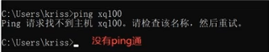

所以我们需要将主机名称和ip地址进行映射，如何映射?我们需要修改windows的hosts文件。找到c:\Windows\System32\drivers\etc下
面的hosts文件，进行相关的编辑：

```
192.168.16.135	HICTCHCOCK # ip地址是linux的ip地址
```

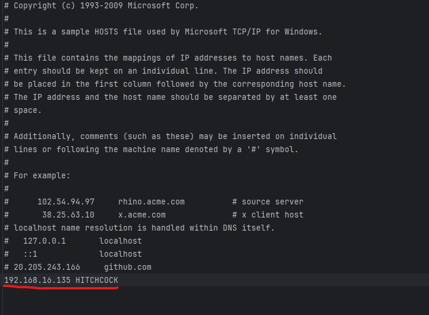

```
C:\Users\Admin>ping HITCHCOCK

正在 Ping HITCHCOCK [192.168.16.135] 具有 32 字节的数据:
来自 192.168.16.135 的回复: 字节=32 时间<1ms TTL=64
来自 192.168.16.135 的回复: 字节=32 时间<1ms TTL=64
来自 192.168.16.135 的回复: 字节=32 时间<1ms TTL=64
来自 192.168.16.135 的回复: 字节=32 时间<1ms TTL=64

192.168.16.135 的 Ping 统计信息:
    数据包: 已发送 = 4，已接收 = 4，丢失 = 0 (0% 丢失)，
往返行程的估计时间(以毫秒为单位):
    最短 = 0ms，最长 = 0ms，平均 = 0ms
```

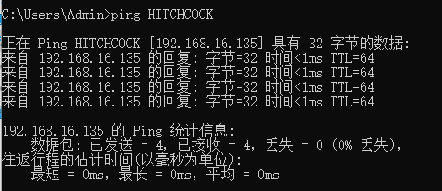

- 同理可以在linux中通过windows主机名ping通

​		DESKTOP-01S025B

我们需要编辑/etc/hosts文件:

```
[root@HITCHCOCK ~]# vim /etc/hosts
[root@HITCHCOCK ~]# ping DESKTOP-01S025B
```

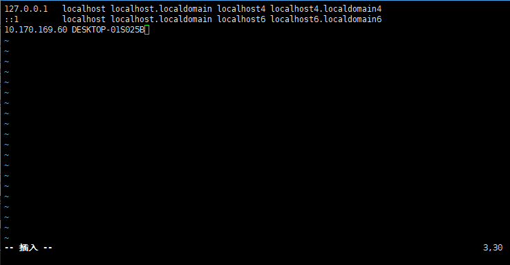

注意：如果ping不通，需要关闭windows的防火墙。
思考：为什么通过主机名（域名)就能找到对应的ip地址呢，接下来我们就分析一下主机名(域名)解析机制：
应用实例：用户在浏览器输入www.baidu.com如何找到百度服务器地址的?
1、浏览器先检查浏览器缓存中有没有该域名解析ip地址，有就先调用这个ip完成域名解析。如果没有就检查DNS解析器缓存，如果有就直接返回ip完成解析。这两个缓存可以理解为本地解析器缓存。
2、如果本地解析器缓存没有找到对应的映射，再去检查系统中的hosts文件中有没有配置对应的域名ip映射，如果有，就完成域名解析。
3、如果本地DNS缓存和hosts文件中均没有找到对应的ip，则到DNS域名服务器完成域名解析。
4、如果公网的DNS域名解析器也没有完成域名解析，就返回资源找不到的信息。

## 1.5linux进程管理

### 1.5.1进程的基本介绍


<span id="1.5.1"></span>

```
[root@HITCHCOCK ~]# ps
   PID TTY          TIME CMD
 14602 pts/1    00:00:00 bash
 31633 pts/1    00:00:00 ps
```


| 字段 | 说明                 |
| ---- | -------------------- |
| PID  | 进程识别号           |
| TTV  | 终端机号             |
| TIME | 此进程所消耗cpu时间  |
| CMD  | 正在执行命令或进程名 |


我们也可以加上下面几个参数，来查看进程信息
ps-a:显示终端所用的进程信息
p$+u以用户的格式显示进程的信息
ps-x显示后台程序运行的参数

```
[root@HITCHCOCK ~]# ps -aux | more	#分页展示进程信
```

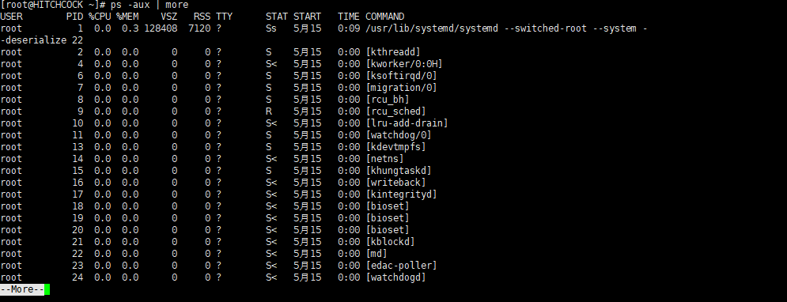

user:进程所属的用户信息	
PID:进程号	
%CPU：进程占用cpu的百分比	
%MEM:进程占用内存的百分比													
STAT:进程的状态	S：睡眠	R:正在货运行	Z:僵死进程

STRAT:进程的开启时间	
TIME:进程消耗CPU的时间		
COMMAND:进程启动需要用到的命令和参数

### 1.5.3进程的应用实例

需求：以全格式显示当前的所有进程,查看进行的父进程.查看sshd的父进程信息。

- ps -ef 以全格式查看所有的进程信息

-  -e:所有的格式		-f:全格式显示进程信息

这样看十分不直观,可以用|过滤一下

- 查看指定的进程信息

pf -ef | grep 进程信息	ps -ef | grep sshd

```c
[root@HITCHCOCK ~]#  ps -ef | grep sshd
root       1137      1  0 5月15 ?       00:00:00 /usr/sbin/sshd -D
root      14586   1137  0 00:15 ?        00:00:00 sshd: root@pts/1
root      31973  14602  0 14:30 pts/1    00:00:00 grep --color=auto sshd
用户		 PID   父进程PID

```

也就是说sshd进程id是1137,其父进程id是1。14586的进程的父进程是进程id为1137的进程


### 1.5.4终止进程

若是某个进程执行一半需要停止的时候，或是已经消耗了很大的系统资源时候，可以考虑停止该线程。

基本语法：

kill [选项]进程号 : 通过进程号杀死进程

killall ：会杀死当前的进程及其子进程

常用选项：

-9表示强迫进程立即停止

- 需求1 ：强制让登陆用户xq下线

我们首先在xshell终端使用xq登陆。然后在另外一个终端使用root用户登录，并在root用户下面执行指令：

ps-aux | grep sshd。

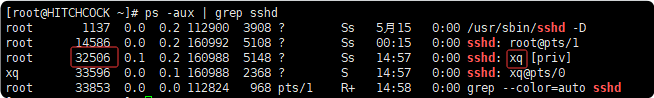

此时我们发现xq用户的进程id是32506.我们在root用户下面使用kill命令来终止这个进程。

```cpp
[root@HITCHCOCK ~]# kill 32506
```

回到Xshell，我们发现xq这个用户已经被注销了。

- 需求2：终止远程登录服务sshd。不允许远程登录。然后重启sshd服务，允许远程登录。

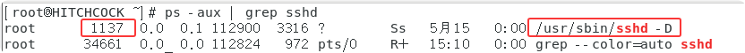

```bash
[root@HITCHCOCK ~]# ps -aux | grep sshd
root       1137  0.0  0.1 112900  3316 ?        Ss   5月15   0:00 /usr/sbin/sshd -D
root      34661  0.0  0.0 112824   972 pts/0    R+   15:10   0:00 grep --color=auto sshd
[root@HITCHCOCK ~]# kill 1137
```

我们使用xshell远程登陆，发现不起作用了。此时我们可以使用/bin/systemctl start sshd.service重启ssd服务，这样就可以再次远程登陆了。

```bash
[root@HITCHCOCK ~]# /bin/systemctl start sshd.service
[root@HITCHCOCK ~]# ps -aux | grep sshd
root      34977  0.0  0.2 112900  4304 ?        Ss   15:20   0:00 /usr/sbin/sshd -D
root      34988  0.0  0.0 112824   972 pts/0    R+   15:20   0:00 grep --color=auto sshd

```

- 需求3 : 终止多个gedit(记事本打开文件的进程），演示killall。

我们在linux图形化界面里面打开多个记事本。然后在Xshell里面使用killall命令：

```bash
[root@HITCHCOCK ~]# killall gedit
```

此时记事本打开的文件就会自动被关闭。

●需求4：强制杀掉一个终端
比如我们在linux图形化界面里面开启两个命令终端：

 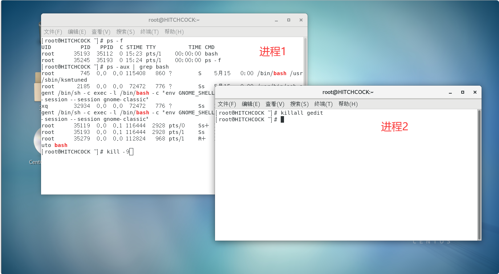

```bash
[root@HITCHCOCK ~]# kill -9 35193
```

### 1.5.5查看进程树

pstree[选项]，可以更加直观的来查看进程信息

-p:显示进程的PID。
-u:显示进程的所属用户。

- 案例1：以树状的形式显示进程的PID

```bash
[root@HITCHCOCK ~]# pstree  #显示进程树
[root@HITCHCOCK ~]# pstree -p #显示进程树（携带进程号）
```

- 案例2：以树状的形式展示进程的用户信息

```bash
[root@HITCHCOCK ~]# pstree -u
```

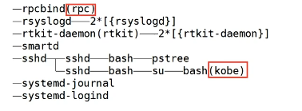

## 1.6	linux服务管理

service(本质)就是进程，但是是运行在后台的，通常都会监听某个端口，等待其他程序的请求，比如说(mysql3306，sshd22，redis6379)，因为我们又称为守护进程，在Linux中是重要的知识点。
下面我们用一幅图来解释什么是守护进程：


### 1.6.1 service指令

- service 服务名 [start| stop,reload,status]

- 在CentOs7.0后，很多服务不再使用service，而是systemctl
- service指令管理的服务在/etc/init.d查看

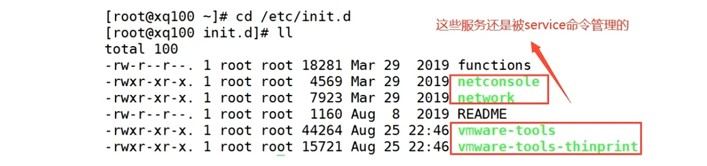

我们可以简单使用一下，比如查看network服务的状态：

```bash
[root@HITCHCOCK init.d]# service network status
已配置设备：
lo ens33
当前活跃设备：
lo ens33 virbr0
```

案例：使用service指令，查看，关闭启动network**[注意在虚拟系统演示时：因为网络连接会关闭]**

```bash
[root@HITCHCOCK ~]# service network stop	#此时Xshell连接linux会连接不上
[root@HITCHCOCK ~]# service network start	#重启网络服务	此时Xshell会连接上Linux
```

- 更多的系统服务，我们可以通过setup指令去查看

```bash
[root@HITCHCOCK ~]# setup
```

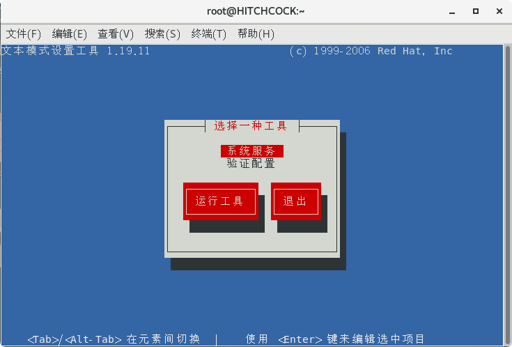

选择系统服务，回车，我们可以看到系统服务的详细信息：

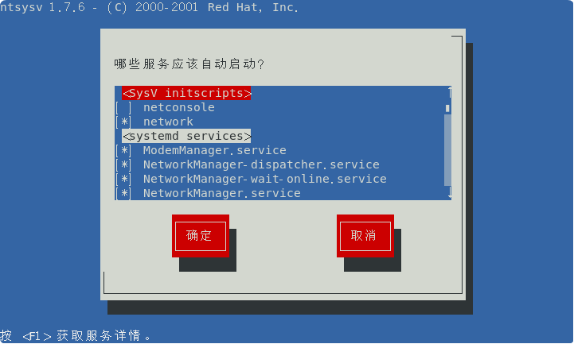

注意:
1.[*]代表这些系统服务会随着开机自启动而启动
2.如果我们想去掉星号或者加上星号，上下按键切换到对应的服务按空格键即可。
3.使用Tab键选择OK或Cancel.


###   1.6.2chkconfig指令

通过chkconfig可以给服务的各个运行级别设置自启动/关闭。

chkconfig指令管理的服务在/etc/init.d查看。

注意：在Centos 7.0以后，很多服务使用systemctl管理。

**基本用法**

chkconfig --list

- 查看服务chkconfig --list[|grep '''']
- 设置服务在指定级别启动/关闭 chkconfig --level network on/off

```bash
[root@HITCHCOCK ~]# chkconfig --list
netconsole     	0:关	1:关	2:关	3:关	4:关	5:关	6:关
network        	0:关	1:关	2:开	3:开	4:开	5:开	6:关
[root@HITCHCOCK ~]# chkconfig --list | grep netconsole	#查看指定的服务
netconsole     	0:关	1:关	2:关	3:关	4:关	5:关	6:关
```

**注意：上面的数字代表linux的运行级别。**

案例：对于netconsole服务，进行各种操作，把network在3运行级别，关闭自启动。

```bash
[root@HITCHCOCK ~]# chkconfig --level 3 netconsole off
[root@HITCHCOCK ~]# chkconfig --level 3 netconsole on
```

注意：chkconfig重新设置服务自启动或者关闭，需要重启机器reboot生效。


### 1.6.3systemctl服务管理指令

systemctl 指令管理的服务在/usr/lib/systemd/system中查看。

- 服务启动/停止/重启/重载/查看状态：systemctl[start | stop | restart | status]服务名

- 查看所有服务的自启动状态

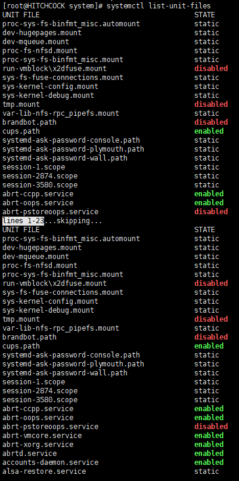

```bash
#查看防火墙服务
[root@HITCHCOCK system]# systemctl list-unit-files | grep firewall
firewalld.service                             enabled 
[root@HITCHCOCK system]# systemctl status firewalld.service #查看防火墙状态
[root@HITCHCOCK system]# systemctl stop firewalld.service #停止防火墙状态
[root@HITCHCOCK system]# systemctl restart firewalld.service #重启防火墙状态
```

服务的状态如下：
**masked** 	 此服务禁止自启动
**static** 	     该服务无法自启动，只能作为其他文件的依赖
**enabled** 	已配置为自启动
**disabled**    未配置为自启动

- 查看某一服务是否自启动

```bash
[root@HITCHCOCK system]# systemctl is-enabled firewalld.service
enabled
```

- 设置服务自启动（服务运行级别3、5）

```bash
[root@HITCHCOCK system]# systemctl enable firewalld.service
```

- 设置服务禁用自启动（服务运行级别3、5）

```bash
[root@HITCHCOCK system]# systemctl disable firewalld.service
```


### 1.6.4防火墙指令

防火墙的核心功能：打开或关闭对应端口。关闭端口，则外部的数据请求不能通过对应的端口，与服务器上的程序进行通信
在真正的生产环境，为保证安全，需要启动防火墙并配置打开和关闭的端口。

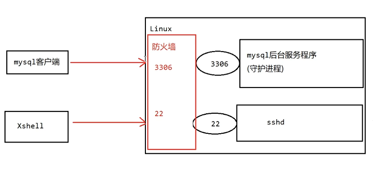

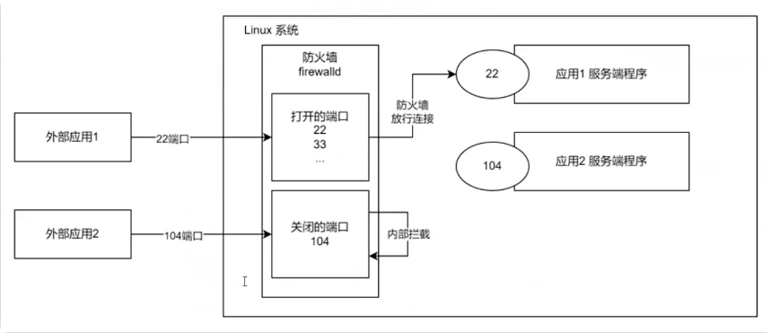

想让服务能被外界访问，必须开放对应服务端口的访问权限（防火墙中的访问权限）

开放权限后需要重载防火墙（reload）

基本语法：

- 打开端口/允许协议

  firewall-cmd --permanent --add-port=端口号/协议

- 关闭端口/禁用协议

  firewall-cmd --permanent --remove-port=端口号/协议

- 查询端口/协议是否开启

  firewall-cmd --query-port=端口/协议

- 查询防火墙所有开放的端口/协议配置

  firewall-cmd --list-ports

- 重载防火墙

  firewall-cmd --reload

```bash
[root@HITCHCOCK system]# firewall-cmd --list-ports	# 查询防火墙开启的端口有哪些
													#无
[root@HITCHCOCK system]# firewall-cmd --query-port=3306/tcp	# 查看防火墙是否开启3306端口
no
[root@HITCHCOCK system]# firewall-cmd --permanent --add-port=3306/tcp	# 开放防火墙对3306端口的访问权限
success
[root@HITCHCOCK system]# firewall-cmd --reload	# 重载防火墙
success
[root@HITCHCOCK system]# firewall-cmd --list-ports
3306/tcp

```


## 1.7动态监控

top与ps命令一样，它们都用来显示正在执行的进程。top与ps最大的不同之处，在于top在执行一段时间可以更新正在运行的进程。
基本语法：

top[选项]

| 选项   | 功能                                   |
| ------ | -------------------------------------- |
| -d秒数 | 指定top命令每隔几秒刷新，默认3秒       |
| -i     | 使用top不显示任何闲置或者僵死的进程    |
| -p     | 通过指定监控ID来仅仅监控某个进程的状态 |

### 1.7.1 top指令详解

```bash
[root@HITCHCOCK ~]# top
```

我们会发现进程信息会每3秒钟就会刷新1次。

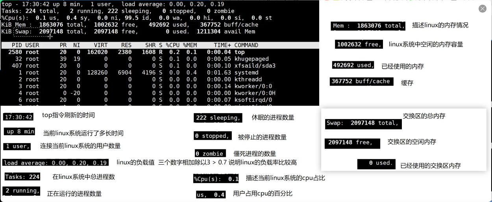


### 1.7.2 top指令的交互操作

当我们输入top命令之后，我们可以按下面的字符来进行对应的交互操作。
交互操作说明:

| 操作 | 功能                            |
| ---- | ------------------------------- |
| P    | 以cpu使用率来排序，默认就是此项 |
| M    | 以内存使用率来排序              |
| N    | 以PID排序                       |
| q    | 退出top                         |

应用实例：

先输入top指令，然后按小写的u，最后输入xq然后回车，查看执行的进程


最后查看效果：

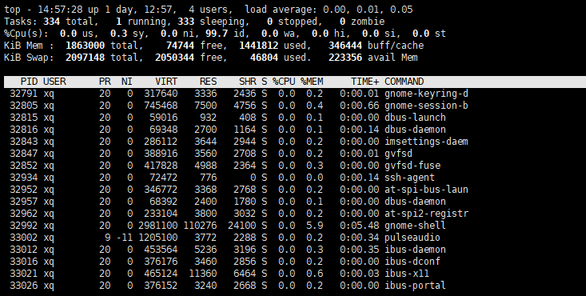

**2.终止指定的进程，比如我们要结束xq登录**
top:输入此命令，然后回车，查看执行的进程
k：然后输入要结束的进程ID号回车之后输入9强制删除。

### 1.7.3 监控网络状态

基本语法：netstat[选项]
选项说明 -an 按照一定的属性排列输出  p 显示哪个进程在调用

```bash
[root@HITCHCOCK ~]# netstat -anp | more
```

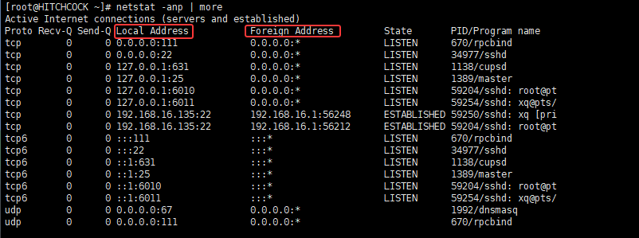

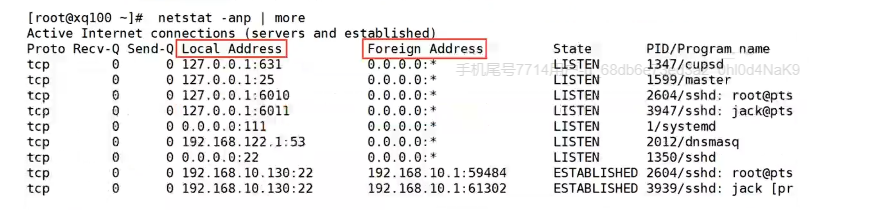

LocalAddress:本机linux的ip地址
ForeignAddress:外部的网络地址
tcp:网络协议
127.0.0.1/0.0.0.0:当前linux机器的本地地址
631/25/6060...应用程序监听的端口号
State:LISTEN监听状态ESTABLISHED：建立连接的状态
PID:应用程序的进程号Program name:应用程序的名称
如何理解Foreign Address呢?

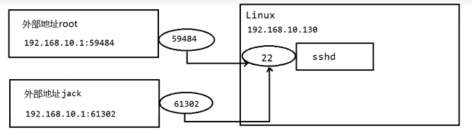


应用案例：
查看服务名称为sshd的服务信息。

```bash
[root@HITCHCOCK ~]# netstat -anp | grep sshd
```

## 1.8 rpm与yum

### 1.8.1 rpm

rpm是互联网下载包和打包和安装工具，他包含在某些linux分版中，他具有生产.rpm扩展名的文件，RPM是redhat package manage
(软件包管理工具的缩写），**类似于setup.exe。**

rpm相关指令：

- 

- 查询所有安装的rpm列表

```bash
[root@HITCHCOCK ~]# rpm -qa | more
```

- 查询当前系统中是否安装了指定的软件

```bash
[root@HITCHCOCK ~]# rpm -qa | grep firefox # 查询linux系统中是否已经安装了火狐浏览器
firefox-68.10.0-1.el7.centos.x86_64

```

> firefox-68.10.0-1.el7.centos.x86_64
>
> - firefox     rpm包的名称
>
> - 60.8.0-1.el7     rpm包的版本号
> - centos     rpm包适配的linux操作系统
>
> - x86_64     适配64位的linux操作系统    (i686 i386结尾的就是linux32位的操作系统 noarch表示通用)

- 查看软件包是否安装

```bash
[root@HITCHCOCK ~]# rpm -q firefox #查询火狐浏览器是否以rpm方式安装
firefox-68.10.0-1.el7.centos.x86_64
```

rpm -qi firefox 查看firefox安装的详细信息

- 查看rpm包安装之后的文件

```
rpm -ql firefox-68.10.0-1.el7.centos.x86_64 查看firefox安装之后的文件
```

- 查看指定的文件所属的rpm包

```
rpm -qf /etc/firefox/pref 查看指定文件所属的rpm包
```

rpm -e firefox 删除rpm包文件

rpm -e --nodeps firefox 强制删除rpm包 （ --nodeps）不考虑依赖

- 安装rpm包

**基本语法**：

rpm -ivh rpm包全路径名称

i：install 安装

v：verbose 安装的时候，显示安装的详细信息

h：hash 进度条

### 1.8.2 yum


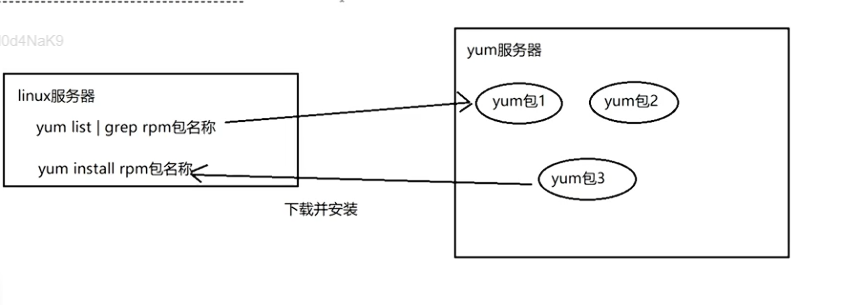


# 2 linux-shell


https://pan.baidu.com/s/10qNP5Zfkc0TTAWYbMlBRWA


## 指令

linux网络地址

```
ip addr
```

重启

```
reboot
```

查看磁盘分区

```
lsblk
lsblk -f
```

磁盘分区

```
fdisk
```

格式化磁盘

```
mkfs -t ext4 /dev/sdb1
ext4:文件类型格式化为ext4类型
/dev/sdb1:哪个磁盘,这里为sdb1磁盘
```

磁盘挂载(临时)

```
mount /dev/sdb1 /newdisk/
将sdb1挂载在根目录下的newdisk目录
```

永久挂载


 [查询指定目录的磁盘占用情况](#target) 

```
du -h[目录] 
```

[查看后台进程](#1.5.1)

```
ps
```

## 📊 命令速查表

| 需求                   | 命令                                           | 说明                                       |
| :--------------------- | :--------------------------------------------- | :----------------------------------------- |
| 查看当前默认模式       | `systemctl get-default`                        | 输出 graphical.target 或 multi-user.target |
| 临时切换（当前会话）   | `Ctrl+Alt+F1~F6`                               | F1=图形，F2-F6=命令行                      |
| 设置默认命令行模式     | `sudo systemctl set-default multi-user.target` | 重启后生效                                 |
| 设置默认图形界面模式   | `sudo systemctl set-default graphical.target`  | 重启后生效                                 |
| 立即切换（不重启）     | `sudo systemctl isolate multi-user.target`     | 从图形立即切命令行                         |
| 立即切回图形（不重启） | `sudo systemctl isolate graphical.target`      | 从命令行立即切回图形                       |
